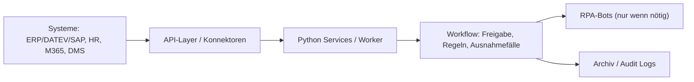
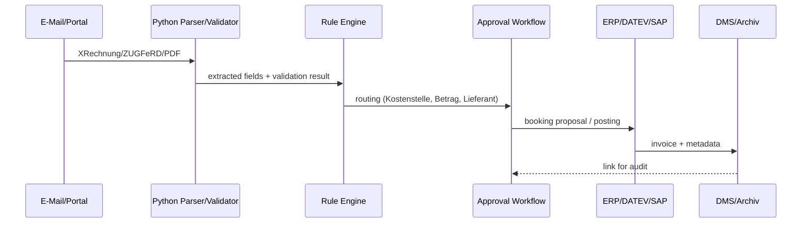

*Von **Reza Noel** • Stand: 01.01.2026

> [!abstract] Kurz & Knapp (TL;DR)
> **Python lohnt sich im Backoffice**, wenn deine Firma regelmäßig dieselben Dinge wiederholt: Rechnungen prüfen, Daten übertragen, Mails sortieren, Dokumente erzeugen, Reports bauen.  
> Mein Vorschlag: **API-first**, wo es geht (SAP/Microsoft 365/HR-Tools). **RPA** nur dort, wo Systeme keine sauberen Schnittstellen haben.  
> In Deutschland kommt dazu: **DSGVO**, **Aufbewahrungspflichten**, und jetzt auch **E-Rechnung** (XRechnung/ZUGFeRD). Wenn du das von Anfang an richtig aufsetzt, ist Automatisierung kein Risiko, sondern ein Wettbewerbsvorteil.

---

## Inhaltsverzeichnis
- [Warum deutsche Unternehmen gerade jetzt automatisieren (müssen)](#warum-deutsche-unternehmen-gerade-jetzt-automatisieren-müssen)
- [Mein 3-Schritte-Ansatz (Reza Noel): API-first → Workflow → RPA als letzte Meile](#mein-3-schritte-ansatz-reza-Noel-api-first--workflow--rpa-als-letzte-meile)
- [ROI ohne Bullshit: So rechnest du es als Arbeitgeber](#roi-ohne-bullshit-so-rechnest-du-es-als-arbeitgeber)
- [Use Case 1: Eingangsrechnungen & E-Rechnung (XRechnung/ZUGFeRD)](#use-case-1-eingangsrechnungen--e-rechnung-xrechnungzugferd)
- [Use Case 2: Reisekosten/Spesen – weniger Papier, weniger Fehler](#use-case-2-reisekostenspesen--weniger-papier-weniger-fehler)
- [Use Case 3: HR-Onboarding/Offboarding – Accounts, Rechte, Geräte](#use-case-3-hr-onboardingoffboarding--accounts-rechte-geräte)
- [Use Case 4: Vertrags- & Dokumentenautomation (Angebote, Bescheide, Standardbriefe)](#use-case-4-vertrags---dokumentenautomation-angebote-bescheide-standardbriefe)
- [Use Case 5: E-Mail- und Ticket-Triage – „Schneller zum richtigen Team“](#use-case-5-e-mail--und-ticket-triage--schneller-zum-richtigen-team)
- [Use Case 6: Monatliches Reporting – Excel-Exports sind kein Prozess](#use-case-6-monatliches-reporting--excel-exports-sind-kein-prozess)
- [Governance in Deutschland: DSGVO, AVV, Aufbewahrung, Betriebsrat](#governance-in-deutschland-dsgvo-avv-aufbewahrung-betriebsrat)
- [Werkzeugkasten: Welche Tools ich wann empfehle](#werkzeugkasten-welche-tools-ich-wann-empfehle)
- [Roadmap 30–60–90 Tage (realistisch für deutsche Firmen)](#roadmap-306090-tage-realistisch-für-deutsche-firmen)
- [FAQ](#faq)
- [Quellen & offizielle Links](#quellen--offizielle-links)
- [Weiterführende Notizen (Zettelkasten / interne Links)](#weiterführende-notizen-zettelkasten--interne-links)

---

## Warum deutsche Unternehmen gerade jetzt automatisieren (müssen)

Zwei Treiber sehe ich 2026 in deutschen Firmen fast überall:

1) **Regulatorik + Standards**  
   E-Rechnung im B2B ist nicht mehr „nice to have“. Das verändert Buchhaltung, Einkauf, Archivierung und IT-Schnittstellen.

2) **Fachkräftedruck im Backoffice**  
   Du findest nicht endlos Leute, die den ganzen Tag Copy/Paste machen. Und selbst wenn: Es ist teuer, fehleranfällig und nervt.

> [!note] Meine Sicht als Reza Noel
> Die meisten Firmen verlieren nicht an „fehlender Digitalisierung“, sondern an **Reibung**: 20 Mini-Aufgaben pro Tag, die niemand als Projekt sieht – aber am Ende sind es 2–3 Vollzeitstellen „verbrannte Zeit“.

---

## Mein 3-Schritte-Ansatz (Reza Noel): API-first → Workflow → RPA als letzte Meile

> [!info] Prinzip
> **API-first** (sauber, stabil, auditierbar)  
> **Workflow-Orchestrierung** (wer macht wann was, mit Logs)  
> **RPA** nur dort, wo es keine API gibt (Legacy-UI, Portale, Sonderformate)

---

## ROI ohne Bullshit: So rechnest du es als Arbeitgeber

> [!tip] ROI-Formel, die ich in Projekten nutze  
> **Jährlicher Nutzen ≈ (Eingesparte Arbeitsstunden × Personalkostensatz) + (Fehlerkosten ↓) + (Skalierung ohne neue Köpfe)**  
> **Payback (Monate) ≈ Invest / (Nutzen pro Monat)**

### Beispiel-Rechnung (du kannst sie 1:1 übernehmen)

Angenommen:

- 8.000 Eingangsrechnungen/Jahr
    
- manuelle Bearbeitung: 8 Minuten → nach Automation: 3 Minuten
    
- Netto-Ersparnis: 5 Minuten pro Rechnung = 40.000 Minuten = 667 Stunden/Jahr
    
- Vollkosten Backoffice (realistisch, inkl. Nebenkosten/Overhead): 35–55 €/h _(je nach Branche/Region)_
    

**Ersparnis/Jahr:** 667h × 35–55 € = **23.345–36.685 €**  
Wenn dein MVP 20–35k kostet, bist du häufig **in 7–18 Monaten** im Payback.

> [!warning] Wichtig  
> Ich verspreche keine Fantasie-ROI-Zahlen.  
> In Deutschland zählen **Auditierbarkeit, Fehlerreduktion und Prozessstabilität** oft genauso wie direkte Stundenersparnis.

---

## Use Case 1: Eingangsrechnungen & E-Rechnung (XRechnung/ZUGFeRD)

### Warum das in Deutschland ein „Pflicht-Case“ wird

E-Rechnung im B2B wird ab 2025 eingeführt, mit Übergangsregeln.  
Praktisch heißt das: Du brauchst Prozesse, die **strukturierte Formate** verarbeiten können.

> [!important] Meine Empfehlung (Reza Noel)  
> Starte hier, wenn du 2026 im Backoffice ROI sehen willst.  
> Rechnungen sind hochvolumig, standardisiert, und Fehler sind teuer.

### Tool-Empfehlung (konkret)

**Wenn ihr SAP/DATEV/ERP mit Schnittstellen habt:**

- API/EDI-Konnektoren + Python Validator/Rule-Engine
    
- Structured Parsing (XML/EN16931)
    
- Workflow: Freigabe (Einkauf → Fachbereich → Finance)
    
- GoBD-konforme Archivierung (DMS, WORM/Immutable Storage)
    

**Wenn ihr noch viele PDF-Rechnungen bekommt:**

- OCR/IDP-Komponente (cloud oder on-prem) + Python Extraktion + Plausibilitätschecks
    
- Parallel: Umstellung auf E-Rechnung (Kunden/Lieferanten aktiv mitnehmen)
    

### Welche Rollen brauchst du?

|Rolle|Warum|Typisches Profil|
|---|---|---|
|Prozess-Owner Finance|Regeln + Freigaben + Ausnahmefälle|Leiter Buchhaltung / AP-Lead|
|Python Automation Engineer|Parser, Regeln, Schnittstellen, Logging|Python Backend (APIs, ETL)|
|ERP/DATEV/SAP Berater|Buchungslogik + Konten + Export/Import|ERP Consultant|
|IT-Security/DSB|DSGVO, Zugriff, Logs, AVV|Informationssicherheit + Datenschutz|
|(Optional) DMS/Archiv Experte|Aufbewahrung, Unveränderbarkeit, Audit|DMS/Compliance|

### Budget & Nutzen (realistische Bandbreiten)

> [!note] Invest-Bandbreite (typisch)
> 
> - **MVP (6–10 Wochen):** 20k–60k (je nach ERP-Reife + OCR + Freigabeworkflow)
>     
> - **Rollout (3–6 Monate):** 60k–180k (mehr Standorte, mehr Regeln, bessere Integration)
>     

> [!tip] Nutzen (wo du ihn wirklich siehst)
> 
> - weniger manuelle Erfassung
>     
> - weniger Rückfragen (Freigabe-Workflow)
>     
> - weniger Fehler/Skontoverlust
>     
> - schneller Monatsabschluss
>     

### Mini-Blueprint (Python)

---

## Use Case 2: Reisekosten/Spesen – weniger Papier, weniger Fehler

### Was deutsche Arbeitgeber daran nervt (ehrlich)

- Regeln sind komplex (Belege, Steuersätze, Limits, interne Policies)
    
- Mitarbeiter reichen zu spät ein
    
- Finance rennt hinterher
    

### Tool-Empfehlung

- Wenn ihr schon ein Reisekosten-Tool habt: **API-Integration + Plausibilitätsprüfungen**
    
- Wenn nicht: Start mit **Power Automate** (wenn ihr Microsoft 365 stark nutzt) oder ein dediziertes Expense-Tool + Python Validierung
    

> [!tip] Meine Empfehlung (Reza Noel)  
> Macht keine „Mega-Plattform“ draus.  
> Ziel ist: **Beleg rein → Regelcheck → Freigabe → Buchung → Auszahlung**, fertig.

### Rollen / Team

- Finance Ops (Regeln/Policies)
    
- Python Engineer (API, Datenchecks)
    
- optional RPA Engineer (wenn Portale ohne API)
    

### Budget & Nutzen

- **Budget:** 10k–40k (Integration + Checks + Reports)
    
- **Nutzen:**
    
    - 20–50% weniger Rückfragen
        
    - schnellere Auszahlung
        
    - sauberere Daten für Controlling
        

---

## Use Case 3: HR-Onboarding/Offboarding – Accounts, Rechte, Geräte

### Problem

Ein neues Teammitglied braucht in vielen Firmen:

- Mailbox, Teams/SharePoint Zugriff
    
- Gruppen/Rollen
    
- Tools (Jira, Git, Wiki, VPN)
    
- Laptop-Workflow (IT)
    

Wenn das manuell läuft, entstehen Fehler und Sicherheitslücken (Offboarding!).

### Tool-Empfehlung (konkret)

- **Microsoft 365 / Entra ID / Exchange Online:** Automatisierung über **Microsoft Graph API**
    
- Python Worker, der aus HR-System/Event (z. B. „Startdatum bestätigt“) folgende Actions macht:
    
    - Account anlegen
        
    - Gruppen zuweisen
        
    - Standard-Teams joinen
        
    - Welcome-Mail + Checkliste
        
    - Offboarding: Zugriffe entziehen, Forwarding, Archiv, Ticket an IT
        

> [!example] Warum das CFO/CEO lieben  
> Ein Offboarding-Fehler ist ein Security-Risiko.  
> Das ist schwer in Euro zu messen – aber extrem teuer, wenn es schiefgeht.

### Rollen

- HR Ops (Trigger + Datenqualität)
    
- M365 Admin / IAM Engineer
    
- Python Automation Engineer
    
- IT-Security
    

### Budget & Nutzen

- **Budget:** 15k–70k (je nach Tool-Landschaft)
    
- **Nutzen:**
    
    - weniger Wartezeit am ersten Arbeitstag
        
    - standardisierte Zugriffsrechte
        
    - weniger Security-Leaks beim Offboarding
        

---

## Use Case 4: Vertrags- & Dokumentenautomation (Angebote, Bescheide, Standardbriefe)

### Typische Prozesse

- Angebot → Vertrag → Freigabe → Signatur → Archiv
    
- Standardbriefe an Kunden/Lieferanten
    
- interne Bescheinigungen
    

### Tool-Empfehlung

- Dokument-Templates (DOCX/Markdown) + Python Rendering
    
- Signatur via E-Sign-Anbieter (API)
    
- Archivierung ins DMS + Metadaten
    

> [!tip] Meine Empfehlung (Reza Noel)  
> Fang mit **einem** Dokumenttyp an (z. B. Standardangebot).  
> Wenn das sauber sitzt, skaliert ihr auf 5–10 Dokumente.

### Rollen

- Legal/Procurement Owner
    
- Python Engineer (templating, PDF, workflow)
    
- DMS Admin (Archiv/Metadaten)
    

### Budget & Nutzen

- **Budget:** 10k–60k
    
- **Nutzen:**
    
    - Durchlaufzeit sinkt (Stunden/Tage)
        
    - weniger Formatfehler
        
    - bessere Nachvollziehbarkeit
        

---

## Use Case 5: E-Mail- und Ticket-Triage – „Schneller zum richtigen Team“

### Problem

Viele Firmen haben das gleiche Muster:

- Shared Inbox (buchhaltung@ / hr@ / support@)
    
- 60% sind Routine, 40% sind Sonderfälle
    
- Menschen lesen alles, obwohl es sich kategorisieren lässt
    

### Tool-Empfehlung

- E-Mail Zugriff über Microsoft Graph API
    
- Python: Klassifikation (regelbasiert + optional ML/LLM)
    
- Routing: Ticket-System (Jira Service Management / Zendesk / ServiceNow)
    
- SLA: Eskalation, Reminder, Auto-Reply bei fehlenden Infos
    

> [!warning] Datenschutz/Compliance  
> Wenn du KI/LLM auf E-Mails loslässt, klär zuerst:
> 
> - Datenverarbeitung (intern vs extern)
>     
> - AVV/Art. 28 DSGVO
>     
> - Logging (keine sensiblen Inhalte in Logs)
>     

### Rollen

- Service Owner (Support/HR/Finance)
    
- Python Engineer
    
- IT Security/DSB
    
- optional ML Engineer
    

### Budget & Nutzen

- **Budget:** 10k–80k (je nach KI-Anteil + Ticket-Integration)
    
- **Nutzen:**
    
    - schnellere Erstreaktion
        
    - weniger „falsche Weiterleitung“
        
    - bessere Daten für Prozessverbesserung
        

---

## Use Case 6: Monatliches Reporting – Excel-Exports sind kein Prozess

### Problem

Wenn dein Monatsreport so entsteht:

- „SAP exportieren“ → Excel kopieren → Pivot → Mail → PowerPoint
    

… dann kaufst du jedes Mal Fehler + Zeit + Stress.

### Tool-Empfehlung

- Python ETL (pandas) + definierte Datenquellen (API/DB/Export)
    
- Versionierte Report-Templates
    
- Automatischer Versand + Ablage (SharePoint/DMS)
    
- Optional: Power BI Dataset Refresh via API
    

> [!note] Mein Vorschlag (Reza Noel)  
> Reporting zuerst automatisieren, wenn:
> 
> - es **monatlich** oder **wöchentlich** wiederkommt
>     
> - mehr als 2 Personen daran hängen
>     
> - Entscheidungen davon abhängen
>     

### Rollen

- Controlling Owner
    
- Data Engineer / Python Engineer
    
- optional BI Entwickler
    

### Budget & Nutzen

- **Budget:** 10k–100k (je nach Datenqualität)
    
- **Nutzen:**
    
    - 1–3 Tage weniger Monatsabschluss-Stress
        
    - weniger Fehler
        
    - schneller „drill-down“ bei Fragen
        

---

## Governance in Deutschland: DSGVO, AVV, Aufbewahrung, Betriebsrat

> [!important] Wenn du in Deutschland automatisierst, ist Governance kein „Extra“.  
> Sie ist Teil des Produkts.

### DSGVO & AVV (Auftragsverarbeitung)

Wenn externe Dienstleister personenbezogene Daten in deinem Auftrag verarbeiten, brauchst du i. d. R. eine AVV-Struktur (Art. 28 DSGVO).  
Das beeinflusst Toolwahl (Cloud vs On-Prem), Logging, Zugriff und Anbieter-Verträge.

### Aufbewahrungspflichten (Rechnungen & Belege)

Aufbewahrung ist kein „Archiv-Ordner“. Du brauchst:

- unveränderbare Ablage (je nach System)
    
- Metadaten
    
- schnelle Auffindbarkeit
    
- Lösch-/Retention-Strategie
    

> [!note] Praxis-Tipp  
> Dokumentiere 1 Seite: „Wie beweisen wir im Audit, dass X korrekt ist?“  
> Wenn du das nicht beantworten kannst, ist es keine saubere Automation.

### Betriebsrat / Mitarbeiterüberwachung (falls relevant)

Automations-Logs können schnell wie „Performance Tracking“ wirken.  
Mein Vorschlag: Logs **prozessbezogen**, nicht personenbezogen (wo möglich), und klar definierte Zugriffskreise.

---

## Werkzeugkasten: Welche Tools ich wann empfehle

### 1) Python „API-first“ (mein Favorit)

**Gut für:** M365, ERP-APIs, HR-Tools, Reporting  
**Stack:** FastAPI, Celery/RQ, PostgreSQL, Redis, Docker, CI/CD, Secrets (Vault)  
**Profil:** Python Backend/Automation Engineer

### 2) Power Automate (wenn ihr Microsoft-lastig seid)

**Gut für:** schnelle Flows, Approval, M365 Connectors  
**Profil:** Citizen Dev + IT Governance  
**Hinweis:** Kosten können mit Premium-Connectors/Bots steigen (Lizenzmodell beachten).

### 3) RPA (UiPath/Robocorp & Co.)

**Gut für:** Legacy-UI, Portale ohne API, „letzte Meile“  
**Profil:** RPA Developer + Prozessanalyst  
**Risiko:** UI-Änderungen brechen Bots → Wartungsbudget einplanen

> [!tip] Reza Noel Entscheidungsmatrix (kurz)  
> **API verfügbar?** → Python/API  
> **Nur UI/Portal?** → RPA  
> **Schnell & M365?** → Power Automate (mit Governance)

---

## Roadmap 30–60–90 Tage (realistisch für deutsche Firmen)

> [!checklist] 0–30 Tage: Klarheit + Quick Win
> 
> -  5 Prozesse auswählen (Volumen hoch, Fehler teuer, repetitiv)
>     
> -  1 Prozess als MVP festlegen (z. B. Eingangsrechnungen)
>     
> -  Datenfluss dokumentieren (Systeme, Verantwortliche, Risiken)
>     
> -  Governance klären: DSGVO/AVV/Logging/Retention
>     
> -  Erfolgsmessung definieren (Zeit, Fehler, Durchlaufzeit)
>     

> [!checklist] 31–60 Tage: MVP bauen
> 
> -  Schnittstellen anbinden (API oder RPA)
>     
> -  Regelwerk + Ausnahmen modellieren
>     
> -  Audit-Logs + Monitoring integrieren
>     
> -  Pilot mit 1 Team/1 Standort
>     

> [!checklist] 61–90 Tage: Rollout-Ready
> 
> -  Dokumentation + Runbooks (Support)
>     
> -  Schulung der Prozess-Owner
>     
> -  Erweiterung auf weitere Teams
>     
> -  Backlog: nächste 2 Prozesse
>     

---

## FAQ

Python ist ideal, wenn du stabile Integrationen, Tests, Versionierung, Logging und sauberes Deployment willst. Low-Code ist stark für schnelle Flows – aber bei komplexer Logik und Audits wird Code oft sauberer.

Aus meiner Sicht (Reza Noel): Eingangsrechnungen/E-Rechnung oder HR-Offboarding. Hoher Nutzen, klare Regeln, echte Risiken bei Fehlern.

Durchlaufzeit (Lead Time), Fehlerquote, „Touchless Rate“ (wie viel läuft ohne manuelles Eingreifen), und Payback-Zeit.

RPA nur als letzte Meile einsetzen, UI-Änderungen monitoren, Wartungsbudget einplanen, und wo möglich APIs bevorzugen.

Sehr grob: 20k–60k MVP, 60k–180k Rollout für 1–2 Kernprozesse. Das schwankt stark je nach Systemlandschaft, Datenqualität und Compliance-Anforderungen.

---

## Quellen & offizielle Links

- BMF FAQ zur verpflichtenden E-Rechnung (ab 01.01.2025, Übergangsregeln): [https://www.bundesfinanzministerium.de/Content/DE/FAQ/e-rechnung.html](https://www.bundesfinanzministerium.de/Content/DE/FAQ/e-rechnung.html)
    
- IHK (E-Rechnungspflicht ab 2025, EN 16931, ZUGFeRD/XRechnung): [https://www.frankfurt-main.ihk.de/recht/uebersicht-alle-rechtsthemen/steuerrecht/umsatzsteuer-national/e-rechnungspflicht-ab-2025-6055774](https://www.frankfurt-main.ihk.de/recht/uebersicht-alle-rechtsthemen/steuerrecht/umsatzsteuer-national/e-rechnungspflicht-ab-2025-6055774)
    
- EU-Kommission eInvoicing in Germany (ZUGFeRD 2.1, EN 16931): [https://ec.europa.eu/digital-building-blocks/sites/spaces/DIGITAL/pages/467108886/eInvoicing%2Bin%2BGermany](https://ec.europa.eu/digital-building-blocks/sites/spaces/DIGITAL/pages/467108886/eInvoicing%2Bin%2BGermany)
    
- E-Rechnung Bund FAQ (ZUGFeRD Profil XRECHNUNG / XRechnung): [https://e-rechnung-bund.de/faq/](https://e-rechnung-bund.de/faq/)
    
- Aufbewahrungspflichten (IHK; Hinweis auf Verkürzung bei Buchungsbelegen): [https://www.frankfurt-main.ihk.de/recht/uebersicht-alle-rechtsthemen/steuerrecht/abgabenordnung/aufbewahrung-von-geschaeftsunterlagen-5195530](https://www.frankfurt-main.ihk.de/recht/uebersicht-alle-rechtsthemen/steuerrecht/abgabenordnung/aufbewahrung-von-geschaeftsunterlagen-5195530)
    
- DSGVO Art. 28 (Auftragsverarbeiter): [https://dsgvo-gesetz.de/art-28-dsgvo/](https://dsgvo-gesetz.de/art-28-dsgvo/)
    
- Microsoft Graph – Outlook Mail API Overview (für Inbox-Automation): [https://learn.microsoft.com/en-us/graph/outlook-mail-concept-overview](https://learn.microsoft.com/en-us/graph/outlook-mail-concept-overview)
    
- Power Automate Pricing (als Orientierung, Lizenzmodell prüfen): [https://www.microsoft.com/en-us/power-platform/products/power-automate/pricing](https://www.microsoft.com/en-us/power-platform/products/power-automate/pricing)
    

---

## Weiterführende Notizen (Zettelkasten / interne Links)

- [[Automation/ROI-Rechner-Template]]
    
- [[Automation/API-first-vs-RPA]]
    
- [[Automation/Logging-Audit-Runbook]]
    
- [[Finance/Eingangsrechnungen-Workflow]]
    
- [[Finance/E-Rechnung-XRechnung-ZUGFeRD]]
    
- [[Compliance/DSGVO-AVV-Art28]]
    
- [[Compliance/Aufbewahrung-GoBD-Retention]]
    
- [[HR/Onboarding-Offboarding-Automation]]
    
- [[M365/Microsoft-Graph-Python]]
    
- [[Ops/Reporting-Automation-Pandas]]
    
- [[Ops/Ticket-Triage-Mailbox-Automation]]
    

{
  "@context": "https://schema.org",
  "@type": "FAQPage",
  "mainEntity": [
    {
      "@type": "Question",
      "name": "Warum ist Python besser für die Prozessautomatisierung als Low-Code-Tools?",
      "acceptedAnswer": {
        "@type": "Answer",
        "text": "Python bietet im Vergleich zu Low-Code-Plattformen eine höhere Flexibilität bei komplexen Logiken, eine bessere Versionierung (Git), einfacheres Testing und volle Kontrolle über die Datenverarbeitung, was besonders für die Einhaltung der DSGVO und GoBD in Deutschland entscheidend ist."
      }
    },
    {
      "@type": "Question",
      "name": "Wie hilft Python bei der neuen E-Rechnungspflicht (XRechnung/ZUGFeRD)?",
      "acceptedAnswer": {
        "@type": "Answer",
        "text": "Python kann strukturierte XML-Daten wie XRechnung oder ZUGFeRD nativ parsen, validieren und direkt in ERP-Systeme wie SAP oder DATEV einspeisen. Dies reduziert manuelle Erfassungsfehler und sichert die rechtskonforme Archivierung nach deutschen Standards."
      }
    },
    {
      "@type": "Question",
      "name": "Ist Python-Automatisierung in Deutschland DSGVO-konform?",
      "acceptedAnswer": {
        "@type": "Answer",
        "text": "Ja, sofern die Lösung auf On-Premise-Servern oder bei europäischen Cloud-Anbietern mit entsprechendem AVV (Auftragsverarbeitungsvertrag) betrieben wird. Python ermöglicht durch detailliertes Logging und Zugriffskontrollen eine lückenlose Dokumentation gemäß Art. 28 DSGVO."
      }
    },
    {
      "@type": "Question",
      "name": "Wann lohnt sich der ROI einer Backoffice-Automatisierung?",
      "acceptedAnswer": {
        "@type": "Answer",
        "text": "Bei hochvolumigen Prozessen wie der Rechnungsverarbeitung amortisiert sich die Investition (Payback) oft schon nach 7 bis 18 Monaten, getrieben durch Zeitersparnis, Reduzierung der Fehlerkosten und Skalierbarkeit ohne zusätzliches Personal."
      }
    },
    {
      "@type": "Question",
      "name": "Sollte ich für die Automatisierung RPA oder APIs nutzen?",
      "acceptedAnswer": {
        "@type": "Answer",
        "text": "Der 'API-first'-Ansatz ist immer vorzuziehen, da er stabiler und wartungsärmer ist. RPA (Robotic Process Automation) sollte nur als 'Last Mile' für Altsysteme (Legacy-UI) ohne moderne Schnittstellen eingesetzt werden."
      }
    }
  ]
}

