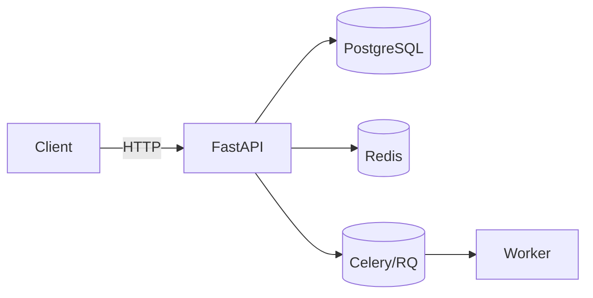
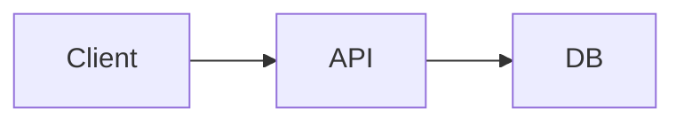

# Warum ein Python-Entwickler Obsidian braucht (2026)
*Von **Reza Noel** • Stand: 27.12.2025*

Als Python-Entwickler verbringt man die meiste Zeit im Terminal oder in der IDE. Doch im Jahr 2026 geht es nicht mehr nur um das Schreiben von Code, sondern um das Managen von Komplexität. Obsidian ist hierbei mehr als nur eine Notiz-App – es ist das neuronale Netzwerk deines Workflows.

> [!abstract] Kurz & Knapp (TL;DR)
> Wenn du Python ernsthaft nutzt (Job, Ausbildung, Freelance, eigene Projekte), kämpfst du täglich mit **Kontextwechsel**, **Wiederholung**, **vergessenen Details** und **„Wie war das nochmal?“**.  
> Obsidian löst das nicht „magisch“ – aber es baut dir ein System, das **dein Denken speichert**, nicht nur Infos.  
> Ergebnis: weniger doppelte Arbeit, schnellere Entscheidungen, klarere Projekte, bessere Doku – und du findest Dinge wieder, wenn du sie wirklich brauchst.

---

## Inhaltsverzeichnis
- [Das Problem im Entwickler-Alltag](#das-problem-im-entwickler-alltag)
- [Was Obsidian für Entwickler anders macht](#was-obsidian-für-entwickler-anders-macht)
- [7 Gründe, warum Python-Entwickler Obsidian brauchen](#7-gründe-warum-python-entwickler-obsidian-brauchen)
- [Praxisbeispiel: FastAPI-Projekt ohne Chaos](#praxisbeispiel-fastapi-projekt-ohne-chaos)
- [Workflows, die wirklich funktionieren](#workflows-die-wirklich-funktionieren)
- [Templates: direkt kopieren und nutzen](#templates-direkt-kopieren-und-nutzen)
- [Vorteile & Nachteile](#vorteile--nachteile)
- [Häufige Fehler (und wie du sie vermeidest)](#häufige-fehler-und-wie-du-sie-vermeidest)
- [FAQ](#faq)
- [Weiterführende Notizen (Zettelkasten)](#weiterführende-notizen-zettelkasten)
- [Quellen & offizielle Links](#quellen--offizielle-links)

---

## Das Problem im Entwickler-Alltag
Python ist „einfach“ – bis du mitten im Alltag steckst:

- Du liest heute eine Lösung zu `async`, morgen brauchst du sie wieder, aber dein Kopf ist leer.
- Du löst einen Bug in Woche 1, in Woche 5 kommt *der gleiche Bug*, nur anders verpackt.
- Du triffst Entscheidungen („Warum JWT so und nicht Sessions?“) und drei Monate später diskutiert ihr das wieder von vorne.
- Du sammelst Links: StackOverflow, Dokumentationen, GitHub-Issues – und findest nichts mehr.

> [!quote]
> „Ich könnte das schnell googeln.“  
> Klar. Aber wenn du das 20-mal pro Woche machst, ist das kein „Schnell“ mehr – das ist ein stiller Zeitfresser.

Und genau hier ist der Punkt:  
**Dein Code ist nicht das einzige Asset.** Dein Wissen, deine Entscheidungen, deine Debugging-Logik – das ist das, was dich als Entwickler besser macht.

---

## Was Obsidian für Entwickler anders macht
Obsidian ist im Kern kein „Notizbuch“. Es ist eher dein persönliches **Developer-Wiki**:

- Du schreibst in **Markdown** (plain text)
- Du verlinkst Notizen wie in einem Wiki: `[[...]]`
- Du kannst Inhalte **einbetten** (Embeds) statt Dinge doppelt zu schreiben
- Du baust eine vernetzte Wissensbasis, statt Ordner-Müll zu sammeln

> [!important] Das Entscheidende (für Devs)
> Obsidian speichert deine Notizen **lokal** als Markdown-Dateien – also wie Code: Dateien, Ordner, Git-Backup möglich.  
> Das fühlt sich für Entwickler sofort „richtig“ an.

---

## 7 Gründe, warum Python-Entwickler Obsidian brauchen

### 1) Du baust ein „Second Brain“ für Debugging (nicht nur für Theorie)
Viele Entwickler dokumentieren erst, wenn alles fertig ist.  
Besser: du dokumentierst **während** du denkst.

> [!tip] Debugging-Notiz in 60 Sekunden
> - Symptom (Fehlermeldung)  
> - Kontext (wo tritt es auf)  
> - Hypothesen (2–3 Möglichkeiten)  
> - Tests (was hast du ausprobiert)  
> - Fix + warum es das war  

➡️ Das wird später Gold, wenn es nochmal passiert.

Verlinke solche Notizen direkt:
- `[[Buglog/fastapi-422-validation-error]]`
- `[[Buglog/sqlalchemy-session-closed]]`

---

### 2) Du machst aus „Wissen“ wiederverwendbare Bausteine (Atomic Notes)
Eine gute Entwickler-Notiz ist **klein**, **klar**, **linkbar**.

Beispiel: statt „FastAPI Notes.md“ (3000 Zeilen) lieber:
- `[[FastAPI/Dependency-Injection]]`
- `[[FastAPI/Background-Tasks]]`
- `[[Auth/JWT-Claims]]`
- `[[Python/Asyncio-Grundlagen]]`

> [!note] Atomic Note Regel
> Eine Note beantwortet idealerweise **eine** Frage.  
> Alles andere wird verlinkt.

---

### 3) Links/Backlinks = Kontext statt Such-Chaos
Du kennst das: du suchst nach „caching“, findest 20 Treffer und keiner passt genau.  
Mit Links passiert etwas anderes: du **navigierst** über Zusammenhang.

Praktisches Beispiel:
- `[[Caching/Redis-Basics]]` verlinkt zu `[[FastAPI/Dependency-Injection]]`
- und zu `[[Architektur/Rate-Limiting]]`

> [!warning] Bitte nicht „blind verlinken“
> Links ohne Begründung sind wie Variablen ohne Namen.  
> Schreib 1 Satz Kontext, *warum* du verlinkst.  
> (Das macht dein Netz später wirklich nützlich.)

---

### 4) Snippet-Library: Code, den du *wirklich* wiederfindest
Python-Entwickler haben meistens irgendwo Snippets:
- in einem Gist
- im Chat
- in einer alten Datei „new2.py“
- oder im Kopf (bis es weg ist)

In Obsidian kannst du eine echte Snippet-Bibliothek bauen:

```python
# [[Snippets/Python/logging-json]]
import json
import logging

class JsonFormatter(logging.Formatter):
    def format(self, record):
        payload = {
            "level": record.levelname,
            "msg": record.getMessage(),
            "logger": record.name,
        }
        return json.dumps(payload, ensure_ascii=False)
````

Und du verlinkst es dort, wo du es brauchst:

* `[[FastAPI/Logging-Setup]]` → `[[Snippets/Python/logging-json]]`

> [!tip] Snippet-Regel
> Jede Snippet-Note bekommt:
>
> * Zweck (1 Satz)
> * Code
> * „Wann nutzen / wann nicht“
> * Links zu Projekten, wo es eingesetzt wurde

---

### 5) Projektmanagement ohne „Extra Tool Overload“

Du brauchst nicht 5 Apps. Für viele Dev-Projekte reicht:

* `Tasks` (Plugin) für echte Aufgaben
* `Dataview` (Plugin) für Listen/Übersichten
* ein sauberes Projekt-Template

So wird aus Notizen ein System, das arbeitet.

Beispiel-Task:

* [ ] API Rate-Limit einbauen 🔁 every week 📅 2026-01-03 #task

Und du kannst Aufgaben aus dem ganzen Vault sammeln.

➡️ Notizen dazu: [[Obsidian/Tasks-Plugin]] • [[Obsidian/Dataview-Grundlagen]]

---

### 6) Architektur verständlich machen (Canvas + Diagramme)

Sobald ein Projekt mehr als „ein Script“ ist, wird Architektur plötzlich wichtig.

Obsidian kann das auf zwei Ebenen:

* schnell: Mermaid-Diagramme in Markdown
* visuell: Canvas (Karten, Pfeile, Gruppen)

Beispiel als Mermaid (lesbar, versionierbar):



> [!note] Warum das für Python zählt
> Viele Bugs sind nicht „Code-Bugs“, sondern **System-Bugs**:
> falsche Grenzen, falsche Abhängigkeiten, fehlende Observability.
> Eine sichtbare Architektur spart Diskussionen.

---

### 7) Du dokumentierst Entscheidungen (und sparst dir endlose Re-Meetings)

Eine der teuersten „Unsichtbaren Kosten“ in Dev-Teams: Entscheidungen werden vergessen.

Mach eine Note:
`[[ADR/0003-auth-jwt-vs-session]]`

Minimalstruktur:

* Kontext
* Entscheidung
* Begründung
* Konsequenzen
* Links zu Code/PR/Issue

> [!tip] 2-Minuten-ADR
> Du brauchst keine Roman-Doku.
> Du brauchst nur genug, damit „Future You“ nicht wieder bei null startet.

---

## Praxisbeispiel: FastAPI-Projekt ohne Chaos

Stell dir vor, du baust ein kleines SaaS-Backend:

* FastAPI
* PostgreSQL
* Auth (JWT)
* Background Jobs (z. B. E-Mail)
* Monitoring/Logging

### Ordner-/Vault-Struktur (simpel, dev-freundlich)

```text
00_Inbox/
10_Projects/
20_Knowledge/
30_Snippets/
40_ADR/
50_Buglog/
90_Archive/
```

> [!tip] Warum so?
>
> * Inbox: alles schnell reinwerfen
> * Projects: „lebende“ Projektseiten
> * Knowledge: erklärende Atomic Notes
> * Snippets: wiederverwendbarer Code
> * ADR/Buglog: Entscheidungen & Debugging als Wissensschatz

---

### Projekt-Start: eine Projektseite als „Home“

Erstelle:
`10_Projects/fastapi-saas.md`

Und verlinke alles Wichtige dort.

> [!example] Mini-Beispiel: Was du verlinkst
>
> * Setup: `[[FastAPI/Projekt-Setup]]`
> * Auth: `[[Auth/JWT-Claims]]`
> * DB: `[[SQLAlchemy/Session-Pattern]]`
> * Deployment: `[[Deploy/Docker-Compose]]`
> * Entscheidungen: `[[ADR/0003-auth-jwt-vs-session]]`
> * Bugs: `[[Buglog/sqlalchemy-session-closed]]`

---

### Embeds: Inhalte nicht kopieren – einbetten

Statt in jedem Projekt wieder zu erklären, wie Logging geht, bettest du es ein:

```md
## Logging
![[FastAPI/Logging-Setup#Minimal-Konfiguration]]
```

Oder sogar ein Block-Embed (für ganz kleine Teile):

```md
![[FastAPI/Logging-Setup#^minimal-json-formatter]]
```

> [!note] Effekt
> Du schreibst „Wissen“ nur **einmal**.
> Überall sonst wird es eingebettet oder verlinkt.

---

## Workflows, die wirklich funktionieren

### Workflow 1: „Heute gelernt“ (Daily Note)

Jeden Tag 3 Zeilen reichen:

* Was habe ich gelernt?
* Was hat mich gebremst?
* Was ist der nächste kleine Schritt?

➡️ Note: [[Workflows/Daily-Devlog]]

---

### Workflow 2: „Buglog wie ein Laborbuch“

Ein Buglog ist kein Tagebuch. Es ist ein *Experiment-Log*.

> [!tip] Buglog ist wie Unit-Testing – nur für dein Denken

➡️ Note: [[Workflows/Buglog-Template]]

---

### Workflow 3: „Reading Notes“ für Dokumentation (PEPs, Libraries, Frameworks)

Du liest Doku nie „zum Spaß“. Du liest, weil du ein Problem lösen musst.

Mach daraus:

* `[[Reading/Pydantic-Validation]]`
* `[[Reading/FastAPI-Dependencies]]`

Und verlinke die Reading Notes direkt zu:

* Buglogs
* ADRs
* Projektseiten

➡️ Note: [[Workflows/Reading-Notes]]

---

## Templates: direkt kopieren und nutzen

### 1) Template: Projekt-Home (Python)

````md
---
type: project
stack: [python]
status: active
created: {{date:YYYY-MM-DD}}
---

# {{title}}

> [!summary] Ziel
> **Was ist das Ergebnis?** (1–2 Sätze)

## Links
- Repo: 
- Deployment:
- Issue-Board:

## Architektur (kurz)


## Aufgaben

* [ ] MVP-Endpoint 1 #task
* [ ] Auth entscheiden #task
* [ ] Logging Setup #task

## Entscheidungen (ADR)

* [[ADR/0001-...]]
* [[ADR/0002-...]]

## Wissensnoten

* [[FastAPI/...]]
* [[Python/...]]
* [[SQLAlchemy/...]]

````

---

### 2) Template: Atomic Knowledge Note
````md
---
type: knowledge
topic: python
created: {{date:YYYY-MM-DD}}
---

# {{title}}

> [!abstract] In einem Satz
> ...

## Problem
- Wann taucht das auf?

## Lösung / Erklärung
- ...

## Beispiel
```python
# ...
```

## Stolperfallen

* ...

## Verlinkung

* Related: [[...]]
* Used in: [[10_Projects/...]]

````

---

### 3) Template: Buglog
````md
---
type: buglog
created: {{date:YYYY-MM-DD}}
project: 
---

# Bug: {{title}}

> [!info] Symptom
> (Fehlermeldung / Verhalten)

## Kontext
- Wo? (Endpoint / Modul)
- Seit wann?
- Was wurde zuletzt geändert?

## Hypothesen
1. ...
2. ...

## Tests
- [ ] Test 1:
- [ ] Test 2:

## Fix
- Was war die Ursache?
- Was war der Patch?

## Prävention
- Test hinzufügen? Doku? ADR?

## Links
- Projekt: [[10_Projects/...]]
- Related: [[Python/...]]
````

---

### 4) Dataview: Alle aktiven Projekte (Beispiel)

> Voraussetzung: Dataview Plugin

```dataview
TABLE status, created, stack
FROM "10_Projects"
WHERE status = "active"
SORT created DESC
```

### 5) Tasks: Alle offenen Tasks mit Fälligkeit

> Voraussetzung: Tasks Plugin

```tasks
not done
due after today
sort by due
```

---

## Vorteile & Nachteile

### Vorteile

* ✅ **Wiederfinden statt Re-Googlen**: Wissen bleibt im System
* ✅ **Links statt Ordner-Kampf**: Kontext schlägt Struktur
* ✅ **Plain-Text-Format / Markdown**: langfristig haltbar, dev-freundlich
* ✅ **Embeds**: du schreibst Dinge einmal, nutzt sie überall
* ✅ **Projekt + Wissen + Entscheidungen** in einem Vault
* ✅ **Erweiterbar** (Plugins), aber nicht zwingend

### Nachteile

* ❌ Du musst dir ein System bauen (am Anfang fühlt es sich „leer“ an)
* ❌ Plugin-Falle: zu viel, zu früh → Chaos
* ❌ Wenn du nur sammelst (Links, Zitate) ohne eigenes Denken, bringt es wenig
* ❌ Team-Standardisierung ist extra Arbeit (Naming, Tags, Struktur)

> [!tip] Realistische Erwartung
> Obsidian ist nicht „Produktivität in 3 Klicks“.
> Es ist eher wie ein gutes Repo: du profitierst, wenn du **Konventionen** einhältst.

---

## Häufige Fehler (und wie du sie vermeidest)

### Fehler 1: 1000 Links ohne Kontext

Wenn jede Note überall hinlinkt, ist nichts mehr wichtig.

**Fix:** Pro Link 1 Satz „Warum“ hinzufügen.

---

### Fehler 2: Ordner-Perfektionismus

Stundenlang Ordner bauen, aber keine Inhalte schreiben.

**Fix:** Starte mit 5–6 Ordnern max. (siehe oben). Rest später.

---

### Fehler 3: Alles in eine Monster-Note

„Python.md“ mit 5000 Zeilen ist kein Wissenssystem, das ist ein Dump.

**Fix:** Atomic Notes + Links.

---

### Fehler 4: Keine „Einstiegsseiten“

Du brauchst Home-Notes:

* pro Projekt eine Startseite
* pro Thema eine Übersicht

➡️ Note: [[MOCs/Map-of-Content-Python]] (MOC = Map of Content)

---

## FAQ

<details>
<summary><strong>Reicht nicht ein Terminal + GitHub?</strong></summary>

Für Code: ja. Für Wissen: selten. GitHub ist super für Source, aber nicht ideal als persönliches Denk- und Entscheidungsarchiv. Obsidian ergänzt das, statt es zu ersetzen.

</details>

<details>
<summary><strong>Was ist der größte Hebel für Python-Entwickler?</strong></summary>

Eine Kombination aus **Snippet-Library**, **Buglog**, **ADRs** und **Projekt-Homepages**. Das sind Dinge, die dir Wochen später Zeit sparen.

</details>

<details>
<summary><strong>Welche Plugins sind „Must-have“?</strong></summary>

Für viele: keine. Wenn du aber strukturierter arbeiten willst: **Tasks** und **Dataview** sind sehr stark. (Erst nutzen, wenn deine Basics sitzen.)

</details>

<details>
<summary><strong>Wie bleibe ich dran?</strong></summary>

Mach es klein: täglich 3 Zeilen im Devlog + pro Bug eine Buglog-Note. Nach 30 Tagen hast du bereits ein echtes System.

</details>

---

## Weiterführende Notizen (Zettelkasten)

> [!quote]
> Baue dir pro Thema kleine Notizen – dann wird das Netzwerk automatisch wertvoll.

### Obsidian Basics

* [[Obsidian/Grundsetup]]
* [[Obsidian/Links-Backlinks-Graph]]
* [[Obsidian/Embeds-Blockreferenzen]]
* [[Obsidian/Canvas-fuer-Architektur]]
* [[Obsidian/Web-Clipper-Workflow]]

### Developer Workflows

* [[Workflows/Daily-Devlog]]
* [[Workflows/Buglog-Template]]
* [[Workflows/Reading-Notes]]
* [[Workflows/ADR-Template]]
* [[Workflows/Snippet-Library]]

### Python Knowledge

* [[Python/Asyncio-Grundlagen]]
* [[Python/Logging]]
* [[Python/Packaging]]
* [[FastAPI/Dependency-Injection]]
* [[SQLAlchemy/Session-Pattern]]

### Produktivität & Denkwerkzeuge

* [[Zettelkasten/Einführung]]
* [[MOCs/Map-of-Content-Python]]
* [[Zeitmanagement/Deep-Work-fuer-Entwickler]]

---

## Quellen & offizielle Links

> [!note]
> Diese Links sind bewusst „stabil“ gewählt: offizielle Dokumentation oder etablierte Community-Projekte.

* Obsidian Help (Data storage): [https://help.obsidian.md/data-storage](https://help.obsidian.md/data-storage)
* Obsidian Help (Graph view): [https://help.obsidian.md/plugins/graph](https://help.obsidian.md/plugins/graph)
* Obsidian Help (Backlinks): [https://help.obsidian.md/plugins/backlinks](https://help.obsidian.md/plugins/backlinks)
* Obsidian Help (Canvas): [https://help.obsidian.md/plugins/canvas](https://help.obsidian.md/plugins/canvas)
* Obsidian Web Clipper (official): [https://obsidian.md/clipper](https://obsidian.md/clipper)
* Dataview Docs: [https://blacksmithgu.github.io/obsidian-dataview/](https://blacksmithgu.github.io/obsidian-dataview/)
* Tasks Plugin Docs: [https://publish.obsidian.md/tasks/Introduction](https://publish.obsidian.md/tasks/Introduction)
* Zettelkasten Einführung: [https://zettelkasten.de/introduction/](https://zettelkasten.de/introduction/)
* Local-first Software (Ink & Switch): [https://www.inkandswitch.com/essay/local-first/](https://www.inkandswitch.com/essay/local-first/)

<div style="display:none" id="seo-data">
{
  "@context": "https://schema.org",
  "@type": "FAQPage",
  "mainEntity": [
    {
      "@type": "Question",
      "name": "Reicht nicht ein Terminal + GitHub für Python-Entwickler?",
      "acceptedAnswer": {
        "@type": "Answer",
        "text": "Während GitHub die Versionierung des Quellcodes übernimmt, dient Obsidian als zentraler Wissensspeicher für Architektur-Entscheidungen, Debugging-Prozesse und langfristiges Projektwissen."
      }
    },
    {
      "@type": "Question",
      "name": "Welche Obsidian-Funktionen sind für Python-Entwickler am wichtigsten?",
      "acceptedAnswer": {
        "@type": "Answer",
        "text": "Interne Links/Backlinks, Embeds, Snippet-Library, Buglog/Devlog und optional Tasks + Dataview für projektübergreifende Übersichten."
      }
    },
    {
      "@type": "Question",
      "name": "Welche Plugins lohnen sich als erstes?",
      "acceptedAnswer": {
        "@type": "Answer",
        "text": "Viele kommen ohne Plugins aus. Wenn du strukturierter arbeiten willst, sind Tasks (für Aufgaben) und Dataview (für Live-Listen/Queries) oft die stärksten ersten Erweiterungen."
      }
    }
  ]
}
</div>
<script>
  const schemaData = document.getElementById('seo-data').innerText;
  const script = document.createElement('script');
  script.type = 'application/ld+json';
  script.text = schemaData;
  document.head.appendChild(script);
</script>
