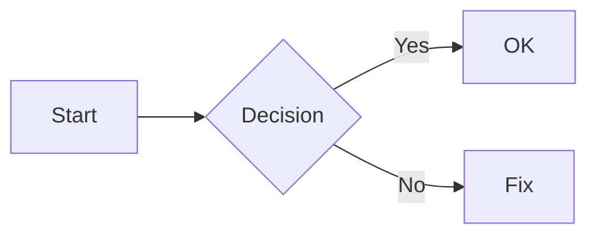

> [!summary] خلاصه
>> توی این مقاله درباره مارک داون صحبت شده که چی هست و چه کمکی به ما میکنه و چطور میتونیم یک فایل مارک داون کامل و کاربردی داشته باشیم، قدم به قدم تمامی قابلیت های مارک دان آموزش داده شده

> [!tip] Youtube Chibode
><div style="position:relative; width:100%; padding-top:56.25%;"><iframe    src="https://www.youtube.com/embed/HeO3sTNuIq8"  style="position:absolute; top:0; left:0; width:100%; height:100%;"    frameborder="0"    allow="accelerometer; autoplay; clipboard-write; encrypted-media; gyroscope; picture-in-picture"    allowfullscreen>  </iframe></div>

---
## 1) فایل Markdown دقیقاً چیه؟

مارک داون یک فرمت متنی ساده‌ست که با چند علامت خیلی سبک، متن رو **ساختارمند** می‌کنه (تیتر، لیست، لینک، جدول، کد و …). خروجی‌اش هم خواناست هم قابل تبدیل به HTML/PDF و… . توی Obsidian چون همه‌چیز فایل متنیه، خیلی سریع و مرتب کار می‌کنی.

فایلش معمولاً با پسوند:

- `.md`

---

## 2) اسکلت یک فایل Markdown استاندارد

بهترین حالت اینه که اول فایل رو با یک عنوان و یک خلاصه شروع کنی، بعد بخش‌بندی منطقی:

```md
# عنوان اصلی

یک مقدمه کوتاه درباره موضوع.

## بخش ۱
متن…

## بخش ۲
متن…

---

## جمع‌بندی
چکیده نهایی…
```

---

## 3) تیترها (Headings)

تیترها با `#` ساخته می‌شن:

```md
# H1 (عنوان اصلی)
## H2
### H3
#### H4
##### H5
###### H6
```

نکته‌ی مهم: معمولاً در هر فایل فقط **یک H1** می‌ذارن (مثل Titel اصلی).

---

## 4) پاراگراف، خط جدید، فاصله

- پاراگراف جدید = یک خط خالی بین دو متن
    
- خط جدید داخل همان پاراگراف:
    
    - در بیشتر Markdownها باید آخر خط **دو تا فاصله** بذاری یا از `<br>` استفاده کنی.
        
    - Obsidian معمولاً با تنظیمات/رفتار خودش خوب هندل می‌کنه، ولی قانون کلی همینه.
        
```md
این یک خط است.<br>
این خط جدید است.
```

---

## 5) بولد، ایتالیک، هایلایت، خط‌خورده

```md
**بولد**
*ایتالیک*
***بولد و ایتالیک***
==هایلایت== (در Obsidian عالی کار می‌کند)
~~خط خورده~~
```

---

## 6) نقل‌قول (Blockquote)

```md
> این یک نقل قول است.
> می‌تواند چند خط باشد.
```

---

## 7) لیست‌ها (Lists)

### لیست نقطه‌ای

```md
- مورد ۱
- مورد ۲
  - زیرمورد ۲.۱
  - زیرمورد ۲.۲
```

### لیست شماره‌ای

```md
1. مرحله اول
2. مرحله دوم
3. مرحله سوم
```

### چک‌لیست (Task List)

این مورد هم در Obsidian خیلی **praktisch** است:

```md
- [ ] انجام نشده
- [x] انجام شده
```

---

## 8) لینک‌ها (Links)

### لینک معمولی

```md
[متن لینک](https://example.com)
```

### لینک با عنوان (Tooltip)

```md
[متن لینک](https://example.com "توضیح کوتاه")
```

---

## 9) تصویر (Images)

```md

```

نکته: داخل Obsidian معمولاً تصاویر رو داخل Vault ذخیره می‌کنی و با embed داخلی میاری (پایین‌تر توضیح می‌دم).

---

## 10) کد (Code)

### کد داخل خط

```md
این یک `inline code` است.
```

### بلاک کد (Code Block)

سه تا بک‌تیک:

````md
```python
def hello():
    print("Hi")
```
````

(داخل Obsidian هم سینتکس هایلایت خیلی خوبه.)

---

## 11) جداکننده (Horizontal Rule)
```md
---
````

---

## 12) جدول (Tables)

```md
| ستون ۱ | ستون ۲ |
|------:|:------:|
| راست‌چین | وسط‌چین |
| داده | داده |
```

راست‌چین/چپ‌چین با `:` کنترل می‌شه.

---

## 13) چک‌باکس + متن توضیحی کنار هم

مثلاً برای برنامه‌ریزی:

```md
- [ ] درس آلمانی (30 دقیقه)
  - نکته: فعل‌ها را مرور کن
```

---

## 14) نقل‌قول کد/متن با تورفتگی (Indent)

چهار فاصله یا تب:

```md
    این متن به‌صورت code-like نمایش داده می‌شود
```

(ولی پیشنهاد: همیشه از سه بک‌تیک استفاده کن.)

---

## 15) کاراکترهای Escape

اگر خواستی خود علامت‌ها نمایش داده بشن (نه اینکه معنی Markdown بدن) از `\` استفاده کن:

```md
\*این متن ایتالیک نمی‌شود\*
```

---

## 16) Footnote (پاورقی)

در Obsidian پشتیبانی می‌شه:

```md
این یک جمله است.[^1]

[^1]: این توضیح پاورقی است.
```

---

## 17) نقل‌قول بلوکی چندگانه + لیست تو در تو

ترکیب‌ها کاملاً مجازه:

```md
> نکته:
> - مورد ۱
> - مورد ۲
```

---

## 18) HTML داخل Markdown

خیلی از Markdownها (از جمله Obsidian) HTML ساده رو قبول می‌کنن:

```md
<span style="color:red">قرمز</span>
<br>
<details>
  <summary>باز کن</summary>
  متن مخفی
</details>
```

نکته: بهتره زیاد وابسته نشی مگر برای نیاز خاص.

---

## 19) پیشنهاد یک قالب “فایل کامل” برای Obsidian

این قالب برای اینکه هر نوتت تمیز و قابل جستجو باشه خیلی خوبه:

````md
---
title: "عنوان"
tags: [موضوع1, موضوع2]
created: 2025-12-26
---

# عنوان

## خلاصه
- یک یا دو خط درباره اینکه این نوت چی می‌گه.

## نکات کلیدی
- نکته ۱
- نکته ۲

## توضیح کامل
متن اصلی…

## مثال
```js
console.log("example")
```

## لینک‌های مرتبط

- [[نوت مرتبط ۱]]
    
- [[نوت مرتبط ۲]]
    

---

## جمع‌بندی

یک پاراگراف نتیجه.

````

بالا اون بخش سه‌خطی `---` اسمش **Frontmatter/YAML** هست (در Obsidian خیلی مهمه).

---

# حالا مهم‌ترین بخش: Obsidian چه قابلیت‌های اضافه‌ای به Markdown می‌دهد؟
Obsidian از Markdown معمولی فراتر می‌ره و چند قابلیت **extra** اضافه می‌کنه که عملاً نوت‌برداری رو شبکه‌ای می‌کنه:

## 1) لینک داخلی به نوت‌ها (Wikilink)
به جای لینک اینترنتی، به نوت‌های داخل Vault لینک می‌دی:

```md
[[اسم نوت]]
````

### لینک با متن نمایشی (Alias)

```md
[[اسم نوت|متن نمایشی]]
```

---

## 2) Embed کردن (Transclusion)

می‌تونی یک نوت یا فایل رو داخل نوت دیگه **نمایش بدی**:

```md
![[اسم نوت]]
```

برای عکس/پی‌دی‌اف/صوت هم همین ایده کار می‌کنه (اگر داخل Vault باشه).

---

## 3) لینک به Heading داخل یک نوت

```md
[[اسم نوت#عنوان بخش]]
```

---

## 4) Block Reference (لینک به یک پاراگراف مشخص)

در Obsidian می‌تونی به یک بلوک خاص لینک بدی.

1. آخر یک پاراگراف یه شناسه بده:
    

```md
این یک پاراگراف مهم است. ^important-block
```

2. از جای دیگر لینک بده:
    

```md
[[اسم نوت#^important-block]]
```

---

## 5) Callouts (باکس‌های هشدار/نکته)

این‌ها تو Obsidian خیلی خوشگل و مرتب‌اند:

```md
> [!note]
> این یک نکته است.

> [!tip]
> یک پیشنهاد کاربردی.

> [!warning]
> هشدار مهم.
```

---

## 6) Properties / Frontmatter قوی‌تر

همون YAML بالای فایل باعث می‌شه:

- فیلتر و سرچ بهتر بشه
    
- با پلاگین‌ها (مثل Dataview) دیتابیس بسازی
    

مثال:

```md
---
type: "lesson"
status: "draft"
topic: "markdown"
---
```

---

## 7) Tagها در Obsidian

هم داخل متن، هم داخل YAML:

```md
#programming #obsidian
```

---

## 8) Mermaid (نمودار با کد)

Obsidian از Mermaid پشتیبانی می‌کنه:

````md

````

---

## 9) Math (فرمول)
با MathJax:

```md
$$
E = mc^2
$$
````

---

## 10) Search پیشرفته + Backlinks + Graph

این‌ها “Markdown syntax” نیستند، ولی قدرت Obsidian هستند:

- **Backlinks**: هر جا به این نوت لینک شده
    
- **Graph View**: نقشه ارتباطی نوت‌ها
    
- **جستجوی پیشرفته**: فیلتر با tag، مسیر، متن و…
    

---

## 11) پلاگین‌ها که Markdown را “سوپرپاور” می‌کنند

خود Obsidian پایه رو می‌ده، ولی با پلاگین‌ها امکاناتی می‌گیری که عملاً Markdown تبدیل به سیستم مدیریت دانش می‌شه:

- **Dataview**: کوئری روی نوت‌ها (مثل دیتابیس)
    
- **Tasks**: مدیریت تسک‌ها با فیلتر و تاریخ
    
- **Templater**: قالب‌های هوشمند و اتومات
    
- **Calendar / Daily Notes**: نوت روزانه و برنامه‌ریزی
    

(این‌ها “قابلیت اضافه به Markdown” هستن چون روی متن .md سوار می‌شن.)

